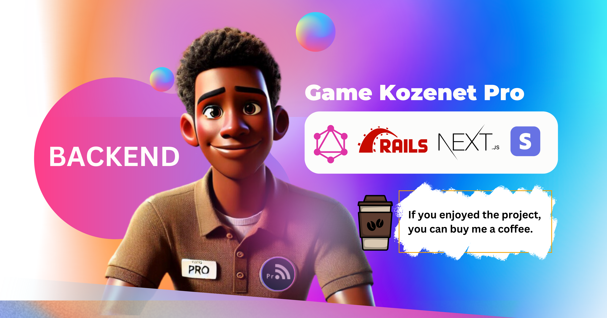

# Interactive Presentation Game

Welcome to the Interactive Presentation Game! This project aims to revolutionize live presentations, making them more engaging and memorable through interactive challenges, voice animations, and quizzes. Designed for meeting events, TikTok Live sessions, university lectures, and work workshops, this game will turn ordinary presentations into extraordinary experiences.

## Features

- **Real-time Audience Interaction**: Engage with your audience through live quizzes and challenges.
- **Voice Animations**: Add dynamic voice animations to react to audience actions.
- **Memorable Moments**: Create unforgettable experiences that attendees will talk about long after the event.
- **Flexible Monetization Plans**: Three plans to suit different needs – Free, Subscribe, and Enterprise.

## Technology Stack

- **Backend**: Ruby on Rails with GraphQL
- **Frontend**: Next.js
- **Mobile**: Flutter
- **Payments**: Stripe

## Why This Project?

I have decided to challenge myself by building this project and documenting each step on social media. The repository will remain public so others can learn from my journey. This project aims to be a useful tool for universities, academic weeks, workshops, and presentations that need interaction and engagement.

- **Programmer's Dashboard**: Explore a custom dashboard I designed for programmers at [Dashboard Template](https://www.kozenetpro.com/l/fullstack).

## Get Involved

Follow my progress, contribute to the project, or just watch how it evolves. If you are an entrepreneur, I also have three futuristic ideas that might interest you – feel free to reach out to me privately.

---

Thank you for your support! Let's transform presentations together! 🚀
